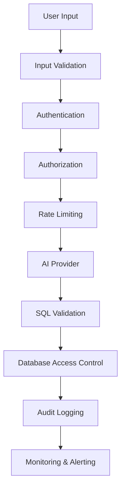

# Security Guide

This guide covers security best practices, threat model analysis, and security configurations for the atest-ext-ai plugin.

## Table of Contents

- [Threat Model](#threat-model)
- [Security Architecture](#security-architecture)
- [Authentication & Authorization](#authentication--authorization)
- [Input Validation & Sanitization](#input-validation--sanitization)
- [Data Protection](#data-protection)
- [Network Security](#network-security)
- [Audit Logging](#audit-logging)
- [Security Monitoring](#security-monitoring)
- [Incident Response](#incident-response)
- [Compliance Considerations](#compliance-considerations)

## Threat Model

### Assets to Protect

1. **Database Credentials**: Connection strings, usernames, passwords
2. **AI API Keys**: OpenAI, Claude, or other provider credentials
3. **Generated SQL Queries**: May contain sensitive business logic
4. **User Input**: Natural language queries may contain sensitive information
5. **Query Results**: Database query results containing sensitive data
6. **System Resources**: CPU, memory, and network resources
7. **Configuration Data**: Plugin configuration including security settings

### Threat Actors

1. **External Attackers**: Attempting to access sensitive data or disrupt service
2. **Malicious Insiders**: Users with legitimate access attempting unauthorized actions
3. **Compromised Accounts**: Legitimate accounts under attacker control
4. **Supply Chain Attacks**: Compromised dependencies or AI providers

### Attack Vectors

1. **Injection Attacks**: SQL injection, prompt injection, command injection
2. **Data Exfiltration**: Unauthorized access to sensitive database content
3. **Denial of Service**: Resource exhaustion through malicious requests
4. **Man-in-the-Middle**: Intercepting communications with AI providers
5. **Configuration Tampering**: Unauthorized modification of security settings
6. **API Abuse**: Excessive usage of AI providers leading to cost attacks

## Security Architecture

### Defense in Depth



### Security Boundaries

1. **Process Boundary**: Plugin runs in isolated process
2. **Network Boundary**: Unix socket for local communication only
3. **Permission Boundary**: Non-root user with minimal privileges
4. **Resource Boundary**: Memory and CPU limits enforced
5. **Data Boundary**: No persistent storage of sensitive data

### Security Controls

```yaml
security:
  # Authentication
  authentication:
    enabled: true
    type: jwt

  # Authorization
  authorization:
    enabled: true
    default_policy: deny

  # Input validation
  validation:
    enabled: true
    max_input_length: 2000
    blocked_patterns: ["(?i)password", "(?i)secret"]

  # Rate limiting
  rate_limit:
    enabled: true
    requests_per_minute: 60
    burst_size: 10

  # SQL validation
  sql_validation:
    enabled: true
    blocked_keywords: ["DROP", "DELETE", "TRUNCATE"]
    max_query_length: 5000

  # Audit logging
  audit:
    enabled: true
    log_all_requests: true
    log_sensitive_data: false
```

## Authentication & Authorization

### JWT Authentication

```yaml
security:
  authentication:
    enabled: true
    type: jwt
    jwt:
      secret: ${JWT_SECRET}      # Use strong, random secret
      algorithm: HS256           # Or RS256 for asymmetric keys
      expiration: 24h
      issuer: atest-ai-plugin
      required_claims:
        - sub                    # Subject (user ID)
        - iss                    # Issuer
        - exp                    # Expiration
        - iat                    # Issued at
```

#### JWT Token Example

```json
{
  "sub": "user123",
  "iss": "atest-ai-plugin",
  "exp": 1640995200,
  "iat": 1640908800,
  "permissions": ["query:generate", "status:read"],
  "context": {
    "user_type": "developer",
    "allowed_databases": ["test", "staging"]
  }
}
```

### API Key Authentication

```yaml
security:
  authentication:
    type: api_key
    api_key:
      header_name: X-API-Key
      query_param: api_key
      keys:
        - key: ${API_KEY_ADMIN}
          name: admin
          permissions: ["*"]
          rate_limit: 120
        - key: ${API_KEY_READONLY}
          name: readonly
          permissions: ["query:generate", "status:read"]
          rate_limit: 60
```

### Role-Based Access Control

```yaml
security:
  authorization:
    enabled: true
    default_policy: deny

    roles:
      admin:
        permissions:
          - "query:generate"
          - "query:execute"
          - "config:read"
          - "config:write"
          - "status:read"
        constraints:
          database_types: ["*"]
          confidence_threshold: ">= 0.5"

      developer:
        permissions:
          - "query:generate"
          - "query:execute"
          - "status:read"
        constraints:
          database_types: ["mysql", "postgresql"]
          confidence_threshold: ">= 0.7"

      readonly:
        permissions:
          - "query:generate"
          - "status:read"
        constraints:
          database_types: ["mysql", "postgresql", "sqlite"]
          confidence_threshold: ">= 0.8"
          max_queries_per_day: 100
```

### Permission Matrix

| Role | Generate SQL | Execute SQL | Config Access | Admin Functions |
|------|-------------|-------------|---------------|-----------------|
| Admin | ✅ | ✅ | ✅ Read/Write | ✅ |
| Developer | ✅ | ✅ | ✅ Read Only | ❌ |
| Readonly | ✅ | ❌ | ❌ | ❌ |
| Guest | ❌ | ❌ | ❌ | ❌ |

## Input Validation & Sanitization

### Natural Language Input Validation

```yaml
security:
  validation:
    natural_language:
      min_length: 10
      max_length: 2000

      # Block sensitive patterns
      blocked_patterns:
        - "(?i)password"
        - "(?i)secret"
        - "(?i)api[_-]?key"
        - "(?i)token"
        - "(?i)credential"
        - "(?i)\\bssh\\b"
        - "(?i)private[_-]?key"

      # Require certain patterns for complex queries
      complexity_requirements:
        min_words: 3
        require_table_reference: false

      # Character restrictions
      allowed_characters: "a-zA-Z0-9\\s\\-_.,!?'"
      max_special_chars: 50
```

### SQL Output Validation

```yaml
security:
  sql_validation:
    enabled: true

    # Blocked SQL keywords
    blocked_keywords:
      - "DROP"
      - "DELETE"
      - "TRUNCATE"
      - "ALTER"
      - "CREATE"
      - "INSERT"
      - "UPDATE"
      - "GRANT"
      - "REVOKE"
      - "EXEC"
      - "EXECUTE"
      - "SHUTDOWN"
      - "KILL"

    # Allowed functions only
    allowed_functions:
      - "SELECT"
      - "COUNT"
      - "SUM"
      - "AVG"
      - "MAX"
      - "MIN"
      - "GROUP_CONCAT"
      - "COALESCE"
      - "CASE"
      - "IF"

    # Query constraints
    max_query_length: 5000
    max_joins: 10
    max_subqueries: 5
    allow_multiple_statements: false

    # Table/column restrictions
    restricted_tables:
      - "users_private"
      - "auth_tokens"
      - "api_keys"
    restricted_columns:
      - "*password*"
      - "*token*"
      - "*secret*"
```

### Input Sanitization Pipeline

```go
func sanitizeInput(input string) (string, error) {
    // 1. Length validation
    if len(input) < 10 || len(input) > 2000 {
        return "", errors.New("input length out of bounds")
    }

    // 2. Character validation
    if !isValidCharSet(input) {
        return "", errors.New("invalid characters detected")
    }

    // 3. Pattern blocking
    for _, pattern := range blockedPatterns {
        if matched, _ := regexp.MatchString(pattern, input); matched {
            return "", errors.New("blocked pattern detected")
        }
    }

    // 4. Normalize whitespace
    normalized := regexp.MustCompile(`\s+`).ReplaceAllString(input, " ")
    normalized = strings.TrimSpace(normalized)

    // 5. Rate limiting check
    if !rateLimiter.Allow(getUserID()) {
        return "", errors.New("rate limit exceeded")
    }

    return normalized, nil
}
```

## Data Protection

### Encryption in Transit

#### TLS Configuration

```yaml
security:
  tls:
    enabled: true
    cert_file: /etc/ssl/certs/plugin.crt
    key_file: /etc/ssl/private/plugin.key
    min_version: "1.2"
    cipher_suites:
      - "TLS_ECDHE_RSA_WITH_AES_256_GCM_SHA384"
      - "TLS_ECDHE_RSA_WITH_AES_128_GCM_SHA256"

  # Unix socket permissions
  unix_socket:
    path: /tmp/atest-store-ai.sock
    permissions: 0660
    owner: atest
    group: atest
```

#### AI Provider Connections

```yaml
ai:
  openai:
    api_base: https://api.openai.com/v1  # Always HTTPS
    verify_ssl: true
    ca_bundle: /etc/ssl/certs/ca-certificates.crt

  claude:
    api_base: https://api.anthropic.com
    verify_ssl: true
    timeout: 30s
```

### Encryption at Rest

#### Configuration Encryption

```bash
# Encrypt sensitive configuration
echo "your-secret-key" | gpg --symmetric --cipher-algo AES256 > config.yaml.gpg

# Decrypt at runtime
gpg --decrypt config.yaml.gpg | atest-store-ai --config -
```

#### Log Encryption

```yaml
logging:
  encryption:
    enabled: true
    key_file: /etc/keys/log_encryption.key
    algorithm: AES256

  audit:
    encryption:
      enabled: true
      rotate_keys: daily
```

### Data Retention

```yaml
security:
  data_retention:
    # Request/response data
    request_logs:
      retention_days: 30
      auto_delete: true

    # Audit logs
    audit_logs:
      retention_days: 365
      archive_after_days: 90

    # Cache data
    cache:
      max_age: 24h
      auto_purge: true

    # Temporary files
    temp_files:
      max_age: 1h
      cleanup_interval: 15m
```

## Network Security

### Unix Socket Security

```bash
# Set restrictive permissions
sudo chown atest:atest /tmp/atest-store-ai.sock
sudo chmod 660 /tmp/atest-store-ai.sock

# Use dedicated directory with proper permissions
sudo mkdir -p /var/run/atest
sudo chown atest:atest /var/run/atest
sudo chmod 750 /var/run/atest
```

### Firewall Configuration

```bash
# Allow only necessary connections
sudo ufw deny incoming
sudo ufw allow outgoing

# Allow specific AI provider endpoints
sudo ufw allow out 443 to api.openai.com
sudo ufw allow out 443 to api.anthropic.com

# Allow local Ollama if used
sudo ufw allow out 11434 to 127.0.0.1
```

### Network Monitoring

```yaml
monitoring:
  network:
    enabled: true

    # Monitor outbound connections
    track_connections: true
    allowed_destinations:
      - "api.openai.com:443"
      - "api.anthropic.com:443"
      - "localhost:11434"

    # Alert on unexpected connections
    alert_unknown_destinations: true

    # Rate limiting
    connection_rate_limit: 10  # per minute
```

## Audit Logging

### Comprehensive Audit Events

```yaml
logging:
  audit:
    enabled: true
    file: /var/log/atest-ai/audit.log
    format: json

    events:
      # Authentication events
      - authentication_success
      - authentication_failure
      - token_expired
      - invalid_credentials

      # Authorization events
      - authorization_success
      - authorization_failure
      - permission_denied

      # Query events
      - query_generated
      - query_executed
      - query_blocked
      - low_confidence_query

      # Configuration events
      - config_loaded
      - config_changed
      - security_setting_modified

      # System events
      - plugin_started
      - plugin_stopped
      - resource_limit_exceeded
      - error_occurred
```

### Audit Log Format

```json
{
  "timestamp": "2024-01-01T12:00:00Z",
  "event_type": "query_generated",
  "severity": "info",
  "user_id": "user123",
  "session_id": "sess_456",
  "source_ip": "192.168.1.100",
  "request_id": "req_789",
  "details": {
    "natural_language": "Find all active users",
    "database_type": "mysql",
    "confidence_score": 0.92,
    "ai_provider": "local",
    "model": "codellama",
    "processing_time_ms": 1200,
    "generated_sql_hash": "sha256:abc123..."
  },
  "metadata": {
    "plugin_version": "1.0.0",
    "environment": "production"
  }
}
```

### Log Monitoring and Alerting

```yaml
monitoring:
  log_analysis:
    enabled: true

    # Real-time alerts
    alerts:
      - name: "Multiple Authentication Failures"
        condition: "authentication_failure count > 5 in 5m"
        severity: "high"
        action: "block_user"

      - name: "Low Confidence Queries"
        condition: "confidence_score < 0.5 count > 10 in 1h"
        severity: "medium"
        action: "notify_admin"

      - name: "Resource Exhaustion"
        condition: "memory_usage > 90% for 5m"
        severity: "critical"
        action: "restart_service"
```

## Security Monitoring

### Metrics Collection

```yaml
monitoring:
  security_metrics:
    enabled: true

    metrics:
      # Authentication metrics
      - authentication_attempts_total{result}
      - authentication_failures_by_user{user_id}
      - token_validations_total{result}

      # Authorization metrics
      - authorization_decisions_total{result,permission}
      - permission_denials_by_user{user_id,permission}

      # Input validation metrics
      - input_validation_failures_total{reason}
      - blocked_patterns_detected_total{pattern}
      - sql_validation_failures_total{reason}

      # Resource usage metrics
      - memory_usage_bytes
      - cpu_usage_percent
      - active_connections
      - request_rate_per_minute
```

### Security Dashboard

```yaml
dashboard:
  panels:
    - title: "Authentication Success Rate"
      query: "rate(authentication_attempts_total{result='success'}[5m])"

    - title: "Failed Logins by User"
      query: "topk(10, sum by (user_id) (authentication_failures_by_user))"

    - title: "Query Confidence Distribution"
      query: "histogram_quantile(0.95, confidence_score_bucket)"

    - title: "Blocked Requests"
      query: "sum(rate(input_validation_failures_total[5m])) by (reason)"
```

### Automated Response

```yaml
security:
  automated_response:
    enabled: true

    rules:
      - name: "Block Suspicious User"
        trigger: "authentication_failures > 5 in 5m"
        action: "block_user"
        duration: "1h"

      - name: "Rate Limit Escalation"
        trigger: "request_rate > 120 per minute"
        action: "reduce_rate_limit"
        new_limit: "30 per minute"
        duration: "10m"

      - name: "Emergency Shutdown"
        trigger: "memory_usage > 95%"
        action: "graceful_shutdown"
        timeout: "30s"
```

## Incident Response

### Incident Classification

| Severity | Description | Response Time | Examples |
|----------|-------------|---------------|----------|
| Critical | System compromise or data breach | 15 minutes | Unauthorized data access, system takeover |
| High | Security control failure | 1 hour | Authentication bypass, privilege escalation |
| Medium | Suspicious activity | 4 hours | Multiple failed logins, unusual queries |
| Low | Policy violation | 24 hours | Exceeded rate limits, minor config issues |

### Response Procedures

#### 1. Detection and Analysis

```bash
# Check for security incidents
tail -f /var/log/atest-ai/audit.log | grep -E "(CRITICAL|HIGH)"

# Analyze authentication failures
jq '.details | select(.event_type == "authentication_failure")' /var/log/atest-ai/audit.log

# Check resource usage
curl http://localhost:9090/metrics | grep -E "(memory|cpu|connections)"
```

#### 2. Containment

```bash
# Emergency shutdown
sudo systemctl stop atest-ai-plugin

# Block suspicious user
curl -X POST http://localhost:9090/admin/block-user -d '{"user_id": "suspicious_user"}'

# Temporary rate limit reduction
curl -X POST http://localhost:9090/admin/rate-limit -d '{"limit": 10}'
```

#### 3. Eradication and Recovery

```yaml
# Update configuration to address vulnerability
security:
  authentication:
    max_failures_before_lockout: 3  # Reduced from 5
    lockout_duration: 30m           # Increased from 15m

  validation:
    blocked_patterns:
      - "new_malicious_pattern"     # Add detected pattern
```

#### 4. Post-Incident Activities

1. **Root Cause Analysis**: Document what happened and why
2. **Security Review**: Update security controls and procedures
3. **Training Update**: Educate team on new threats and responses
4. **Monitoring Enhancement**: Add new alerts and monitoring

### Incident Response Playbooks

#### Playbook 1: Suspected Data Breach

```yaml
steps:
  1. "Immediately stop the plugin service"
  2. "Isolate affected systems from network"
  3. "Preserve logs and forensic evidence"
  4. "Identify scope of potential data exposure"
  5. "Notify security team and stakeholders"
  6. "Begin forensic analysis"
  7. "Implement containment measures"
  8. "Assess legal and regulatory requirements"
```

#### Playbook 2: Authentication System Compromise

```yaml
steps:
  1. "Invalidate all active sessions"
  2. "Rotate all API keys and secrets"
  3. "Enable additional authentication factors"
  4. "Review user access patterns"
  5. "Check for unauthorized configuration changes"
  6. "Update authentication mechanisms"
  7. "Monitor for continued attacks"
```

## Compliance Considerations

### GDPR Compliance

```yaml
privacy:
  gdpr:
    enabled: true

    # Data minimization
    data_retention:
      personal_data: 30d
      pseudonymized_data: 1y
      aggregated_data: 5y

    # Right to erasure
    deletion:
      user_data_purge: true
      log_anonymization: true

    # Privacy by design
    defaults:
      log_ip_addresses: false
      store_query_content: false
      encrypt_audit_logs: true
```

### SOX Compliance

```yaml
compliance:
  sox:
    enabled: true

    # Segregation of duties
    role_separation:
      admin_approval_required: true
      dual_control_changes: true

    # Audit trail
    audit:
      immutable_logs: true
      digital_signatures: true
      timestamp_verification: true

    # Change management
    change_control:
      approval_workflow: true
      rollback_procedures: true
      testing_requirements: true
```

### PCI DSS Considerations

```yaml
security:
  pci_dss:
    # Protect cardholder data
    data_protection:
      mask_sensitive_fields: true
      encrypt_at_rest: true
      encrypt_in_transit: true

    # Access control
    access_control:
      unique_user_ids: true
      strong_passwords: true
      multi_factor_auth: true

    # Monitoring
    monitoring:
      log_all_access: true
      file_integrity_monitoring: true
      intrusion_detection: true
```

## Security Hardening Checklist

### ✅ Configuration Security

- [ ] Use strong, unique passwords and API keys
- [ ] Enable TLS for all network communications
- [ ] Set restrictive file permissions on configuration files
- [ ] Regularly rotate credentials and certificates
- [ ] Disable unnecessary features and endpoints
- [ ] Configure appropriate timeout values
- [ ] Enable audit logging with proper retention
- [ ] Set up monitoring and alerting

### ✅ Runtime Security

- [ ] Run plugin as non-root user
- [ ] Use containerization with security contexts
- [ ] Implement resource limits (memory, CPU, connections)
- [ ] Enable rate limiting and request validation
- [ ] Regular security updates and patches
- [ ] Monitor for unusual activity patterns
- [ ] Implement automated incident response
- [ ] Regular security assessments and penetration testing

### ✅ Data Security

- [ ] Encrypt sensitive data at rest and in transit
- [ ] Implement proper data retention policies
- [ ] Anonymize or pseudonymize logs where possible
- [ ] Secure backup and recovery procedures
- [ ] Regular data access reviews
- [ ] Implement data loss prevention controls
- [ ] Establish secure data disposal procedures

### ✅ Operational Security

- [ ] Security awareness training for team members
- [ ] Incident response procedures documented and tested
- [ ] Regular security reviews and audits
- [ ] Vulnerability management program
- [ ] Supply chain security assessment
- [ ] Business continuity and disaster recovery planning
- [ ] Regular security metric reporting

For implementation details and advanced security configurations, see the [Operations Guide](OPERATIONS.md).